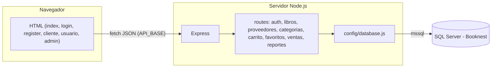
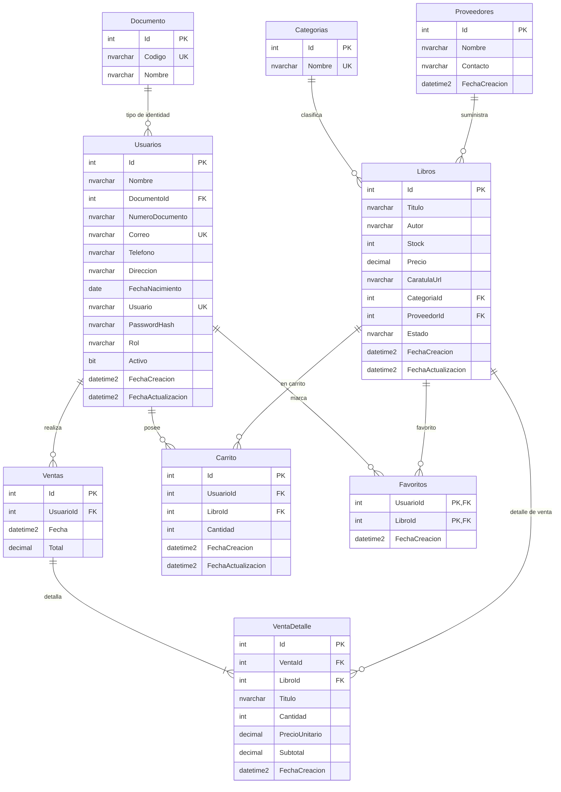

# Libreria-web (Booknest)

Sitio estático (HTML, CSS, JS) más una API en Node.js que habla con **SQL Server**. El navegador no se conecta a la base de datos: solo llama a la API por HTTP.

## Arquitectura



- **Frontend:** páginas HTML en la raíz del repo; la URL base de la API es `window.API_BASE`, definida en `config.js` (por defecto `http://localhost:3000`). Las llamadas van a `/api/...` (ver sección [API: rutas, archivos y uso en el frontend](#api-rutas-archivos-y-uso-en-el-frontend)).
- **Backend:** carpeta `server/` — **Express** escucha en el puerto configurado (por defecto **3000**).
- **Datos:** el paquete **mssql** abre un pool contra SQL Server; las consultas viven en `server/src/config/database.js` y en cada archivo de rutas.

Estructura relevante:

| Ruta en disco | Rol |
|---------------|-----|
| `config.js` (raíz del repo) | Define `window.API_BASE` para que todas las páginas apunten al mismo host/puerto de la API |
| `server/src/index.js` | Arranque, middleware global, montaje de routers bajo `/api/...`, `GET /api/health`, `GET /api/ping-db` |
| `server/src/config/database.js` | Conexión y helpers (`getPool`, `query`, `healthCheck`) |
| `server/src/routes/auth.js` | Login, registro, registro admin, cambio de contraseña, baja de cuenta |
| `server/src/routes/libros.js` | Catálogo CRUD y upsert (`MERGE`) sobre `dbo.Libros` |
| `server/src/routes/proveedores.js` | CRUD de `dbo.Proveedores` |
| `server/src/routes/categorias.js` | Listado de `dbo.Categorias` |
| `server/src/routes/carrito.js` | Carrito por usuario (`dbo.Carrito`): agregar, cantidad, vaciar, eliminar línea |
| `server/src/routes/favoritos.js` | Favoritos por usuario en BD |
| `server/src/routes/ventas.js` | Listado de ventas y checkout (`dbo.Ventas`, stock en `dbo.Libros`) |
| `server/src/routes/reportes.js` | Resumen para panel admin (clientes + proveedores) |
| `server/scripts/create-database.sql` | DDL único: crea base y estructura completa (`Documento`, `Categorias`, `Proveedores`, `Usuarios`, `Libros`, `Ventas`, `VentaDetalle`, `Carrito`, `Favoritos`) |
| `server/scripts/insert.sql` | DML único: catálogos, proveedores, libros semilla y usuario admin de prueba (`admin@booknest.com` / `Abc123`) |

## Modelo entidad-relación (base de datos Booknest)

Definido en `server/scripts/create-database.sql` (SQL Server).

| Entidad | Descripción |
|--------|-------------|
| **Documento** | Catálogo de tipos de documento de identidad (código + nombre). `Usuarios.DocumentoId` referencia aquí; el número va en `Usuarios.NumeroDocumento`. |
| **Categorias** | Categorías de libros (nombre único). `Libros.CategoriaId` es opcional (FK). |
| **Usuarios** | Clientes y empleados (correo y usuario únicos, rol, credenciales). |
| **Libros** | Catálogo con columna calculada **`Estado`**: si `Stock <= 0` es `agotado`, si no es `disponible`. Campo opcional **`Saga`** (serie o saga). |
| **Ventas** | Cabecera de venta ligada solo a `UsuarioId` (nombre y correo del cliente vía `JOIN` a `Usuarios`, sin columnas duplicadas). |
| **VentaDetalle** | Líneas de cada venta (`VentaId`, `LibroId`, `Titulo`, `Cantidad`, `PrecioUnitario`, `Subtotal`), una fila por ítem vendido. |
| **Carrito** | Líneas de carrito por usuario; restricción única `(UsuarioId, LibroId)`. |
| **Favoritos** | Relación usuario-libro para el corazón en catálogo (`PK (UsuarioId, LibroId)`). |
| **Proveedores** | Catálogo de proveedores; `Libros.ProveedorId` referencia esta tabla. |

**Relaciones:**

- **Documento (1) — (0..N) Usuarios**: `Usuarios.DocumentoId` → `Documento.Id` (opcional).
- **Categorias (1) — (0..N) Libros**: `Libros.CategoriaId` → `Categorias.Id` (opcional).
- **Usuarios (1) — (0..N) Ventas**: `Ventas.UsuarioId` → `Usuarios.Id` (obligatorio en el esquema actual; el checkout exige usuario autenticado).
- **Ventas (1) — (1..N) VentaDetalle**: `VentaDetalle.VentaId` → `Ventas.Id`.
- **Libros (1) — (0..N) VentaDetalle**: `VentaDetalle.LibroId` → `Libros.Id`.
- **Usuarios (1) — (1..N) Carrito**: `Carrito.UsuarioId` NOT NULL.
- **Libros (1) — (1..N) Carrito**: `Carrito.LibroId` NOT NULL; única por usuario + libro.
- **Usuarios (1) — (0..N) Favoritos** y **Libros (1) — (0..N) Favoritos**: PK compuesta `(UsuarioId, LibroId)`.



## Carpetas y archivos del servidor: para qué sirven

| Ubicación | Función |
|-----------|---------|
| **`server/package.json`** | Define el proyecto Node (nombre, scripts, dependencias). **`npm install`** lee este archivo y descarga **express**, **mssql**, **cors**, **dotenv**, etc. Los scripts **`npm run start`** y **`npm run dev`** ejecutan `node src/index.js` (el punto de entrada de la API). |
| **`server/.env`** | Variables **solo del servidor** (no deben subirse a git si contienen secretos). Ahí van credenciales y host de SQL Server (`DB_SERVER`, `DB_USER`, `DB_PASSWORD`, `DB_DATABASE`, `PORT`, etc.). **dotenv** las carga al inicio en `index.js` y `database.js` las usa para conectar. Si cambias `.env`, reinicia el proceso de Node. |
| **`server/src/config/`** | Código **compartido de infraestructura**, no rutas HTTP. Aquí está **`database.js`**: crea el pool de **mssql**, expone `getPool()`, `query()`, `healthCheck()`, etc. Las rutas importan este módulo para ejecutar SQL sin repetir la lógica de conexión. Si añadieras Redis u otro cliente, iría en `config/` o en un submódulo similar. |
| **`server/src/routes/`** | Un archivo por **área de la API** (auth, libros, …). Cada uno exporta un **`Router`** de Express con `router.get`, `router.post`, etc. Solo se encarga de HTTP (leer `req.body` / `req.query`, validar, llamar a la BD, responder `res.json`). **No** debe duplicar la configuración del pool: siempre usa `require('../config/database')`. |

El archivo **`server/src/index.js`** une todo: carga Express, CORS, JSON, registra cada router con `app.use('/api/...', require('./routes/...'))` y define rutas sueltas como `/api/health`.

## Verbos HTTP que puedes usar en la API

En Express cada verbo se asocia a un método del router. Los más usados en APIs REST son:

| Verbo | Uso típico | Ejemplo de intención |
|-------|------------|----------------------|
| **GET** | Obtener datos **sin** cambiar el servidor. Puede usar query string (`?id=1`). Debe ser **idempotente** (misma llamada, mismo efecto en el servidor). | Listar libros, obtener un libro por id, health check. |
| **POST** | **Crear** un recurso o disparar una acción que no encaje en GET (p. ej. login). El cuerpo suele ir en JSON (`req.body`). | Registrar usuario, crear libro, iniciar sesión. |
| **PUT** | **Reemplazar** por completo un recurso identificado (p. ej. por id en la URL). | Actualizar todos los campos de un registro. |
| **PATCH** | **Actualizar parcialmente** un recurso (solo algunos campos). | Cambiar solo el stock de un libro. |
| **DELETE** | **Eliminar** un recurso. | Borrar un libro por id. |

Otros (menos habituales en este proyecto): **HEAD** (como GET sin cuerpo), **OPTIONS** (CORS preflight; a menudo lo maneja el middleware). Elige el verbo según semántica y convención REST; lo importante es ser consistente y devolver códigos HTTP claros (`200`, `201`, `400`, `404`, `500`, etc.).

## Paso a paso: crear otra API

1. **Decidir el prefijo y el archivo**  
   Por ejemplo, recursos “reservas” bajo `/api/reservas`. Crea `server/src/routes/reservas.js` (o agrupa en un router existente si es muy pequeño).

2. **Escribir el router**  
   Al inicio del archivo:

   ```js
   const express = require('express');
   const db = require('../config/database');
   const { sql } = db;
   const router = express.Router();
   ```

   Luego define handlers con el verbo adecuado, por ejemplo:

   - `router.get('/', async (req, res) => { ... })` → `GET /api/reservas`
   - `router.post('/', async (req, res) => { ... })` → `POST /api/reservas`
   - `router.get('/:id', async (req, res) => { ... })` → `GET /api/reservas/5`

3. **Acceder a la base de datos**  
   Dentro del handler: `const pool = await db.getPool();`, `const request = pool.request();`, `request.input('nombre', sql.NVarChar, valor);`, `await request.query('SELECT ... WHERE x = @nombre');`. Nunca concatenes strings con datos del usuario en el SQL.

4. **Responder en JSON**  
   Éxito: `res.json({ ... })` o `res.status(201).json({ ... })` para creación. Error: `res.status(400).json({ error: 'mensaje' })`.

5. **Registrar la ruta en `server/src/index.js`**  
   Después de las demás rutas API:

   ```js
   app.use('/api/reservas', require('./routes/reservas'));
   ```

6. **Probar**  
   Con el servidor en marcha (`npm run start` en `server/`), usa el navegador, **curl** o **Postman** contra `http://localhost:3000/api/reservas`. Si el front debe llamarla, usa `fetch` con el mismo origen/puerto que el resto de la app.

7. **(Opcional) Dependencias nuevas**  
   Si necesitas otro paquete npm, en `server/` ejecuta `npm install nombre-paquete`; quedará registrado en **`package.json`** y en **`package-lock.json`**.

## Cómo ejecutar el proyecto

1. Crear la base y tablas ejecutando `server/scripts/create-database.sql` en SQL Server (SSMS o `sqlcmd`).
2. Copiar y completar `server/.env` según tu instancia.
3. En `server/`: `npm install` y `npm run start` (o `npm run dev` con recarga automática).
4. Abrir las páginas HTML (por ejemplo `index.html`) desde el sistema de archivos o sirviéndolas con un servidor estático. Las peticiones `fetch` apuntan a `http://localhost:3000` salvo que cambies la URL en el front.

Comprobaciones útiles:

- `GET http://localhost:3000/api/health` — API y conexión a BD.
- `GET http://localhost:3000/api/ping-db` — versión de SQL Server.
- `GET http://localhost:3000/api/libros` — listado de libros.

## Ingresar un nuevo libro

- **Desde la web (recomendado):** en `admin.html`, el formulario de libros llama a **`POST /api/libros`** (upsert por **MERGE** en SQL: con `id` en el cuerpo actualiza; sin `id` o por título+autor inserta o fusiona según `libros.js`).
- **Directo en SQL Server:** inserta una fila en `dbo.Libros` si prefieres no usar el panel.

1. Conéctate a la base **Booknest**.
2. Ejecuta un `INSERT` respetando las columnas de la tabla (definidas en `create-database.sql`):

   - **Titulo** (obligatorio)
   - **Autor** (opcional)
   - **Estado** es columna calculada por `Stock` (`agotado` o `disponible`)
   - **Stock**, **Precio**
   - **CaratulaUrl** — ruta relativa a la web (ej. `img/BookNest.png`) o URL absoluta; si es `NULL`, el front usa una imagen por defecto.

Ejemplo (también puedes usar o adaptar `server/scripts/insert.sql`):

```sql
USE Booknest;
GO

INSERT INTO dbo.Libros (Titulo, Autor, Stock, Precio, CaratulaUrl, CategoriaId)
VALUES (N'Título del libro', N'Nombre del autor', 10, 29900, N'img/BookNest.png', 1);
GO
```

No hace falta indicar **Id** (es `IDENTITY`). Tras insertar, recarga `index.html` con el API en ejecución para ver el libro en el catálogo.

## Cómo están creadas las APIs

Cada módulo en `server/src/routes/` exporta un `Router` de Express:

1. Se define el método y la ruta **relativa** al prefijo (por ejemplo `router.post('/login', ...)` con prefijo `/api/auth` queda en **`POST /api/auth/login`**).
2. El handler es `async`: obtiene el pool con `await db.getPool()`, arma el `request` de **mssql**, enlaza parámetros con `.input()` para evitar inyección SQL y ejecuta `query()`.
3. La respuesta al cliente es **JSON** (`res.json(...)`) o códigos HTTP de error (`res.status(400).json({ error: '...' })`).

### Montaje en `server/src/index.js` (backend)

```js
app.use('/api/auth', require('./routes/auth'));
app.use('/api/libros', require('./routes/libros'));
app.use('/api/proveedores', require('./routes/proveedores'));
app.use('/api/categorias', require('./routes/categorias'));
app.use('/api/carrito', require('./routes/carrito'));
app.use('/api/favoritos', require('./routes/favoritos'));
app.use('/api/ventas', require('./routes/ventas'));
app.use('/api/reportes', require('./routes/reportes'));
// Además: GET /api/health y GET /api/ping-db definidos en el mismo index.js
```

### API: rutas, archivos y uso en el frontend

La columna **Llamada desde** indica qué página HTML (u otra pieza del cliente) usa `fetch` contra esa ruta. **Base URL:** `window.API_BASE` (`config.js`, por defecto `http://localhost:3000`). Rutas marcadas como *no en HTML* existen en el backend y pueden usarse con Postman, curl o futuros clientes.

| Método | Ruta | Archivo (backend) | Llamada desde (frontend) |
|--------|------|-------------------|---------------------------|
| **GET** | `/api/health` | `server/src/index.js` | Diagnóstico manual / README |
| **GET** | `/api/ping-db` | `server/src/index.js` | Diagnóstico manual / README |
| **POST** | `/api/auth/login` | `server/src/routes/auth.js` | `login.html` |
| **POST** | `/api/auth/register` | `server/src/routes/auth.js` | `register.html` |
| **POST** | `/api/auth/register-admin` | `server/src/routes/auth.js` | `register-admin.html` |
| **POST** | `/api/auth/change-password` | `server/src/routes/auth.js` | `usuario.html` |
| **POST** | `/api/auth/deactivate-account` | `server/src/routes/auth.js` | `usuario.html` |
| **GET** | `/api/libros` | `server/src/routes/libros.js` | `index.html`, `cliente.html`, `admin.html` (catálogo; query opcional `?q=` búsqueda título/autor) |
| **POST** | `/api/libros` | `server/src/routes/libros.js` | `admin.html` (alta/edición por **MERGE**; cuerpo con `id` para actualizar) |
| **PUT** | `/api/libros/:id` | `server/src/routes/libros.js` | *No en HTML actual* (alternativa al POST MERGE) |
| **DELETE** | `/api/libros/:id` | `server/src/routes/libros.js` | `admin.html` |
| **GET** | `/api/proveedores` | `server/src/routes/proveedores.js` | `admin.html` |
| **POST** | `/api/proveedores` | `server/src/routes/proveedores.js` | `admin.html` |
| **PUT** | `/api/proveedores/:id` | `server/src/routes/proveedores.js` | `admin.html` |
| **DELETE** | `/api/proveedores/:id` | `server/src/routes/proveedores.js` | `admin.html` |
| **GET** | `/api/categorias` | `server/src/routes/categorias.js` | `admin.html` |
| **POST** | `/api/carrito/agregar` | `server/src/routes/carrito.js` | `index.html`, `cliente.html` |
| **POST** | `/api/carrito/cantidad` | `server/src/routes/carrito.js` | `cliente.html` |
| **POST** | `/api/carrito/vaciar` | `server/src/routes/carrito.js` | `cliente.html` |
| **POST** | `/api/carrito/eliminar` | `server/src/routes/carrito.js` | `cliente.html` |
| **GET** | `/api/favoritos/:usuarioId` | `server/src/routes/favoritos.js` | `cliente.html` |
| **POST** | `/api/favoritos/toggle` | `server/src/routes/favoritos.js` | `cliente.html` |
| **GET** | `/api/ventas` | `server/src/routes/ventas.js` | `admin.html` (todas las ventas); `usuario.html` con `?usuarioId=<id>` (historial del cliente) |
| **POST** | `/api/ventas/checkout` | `server/src/routes/ventas.js` | `cliente.html` (finalizar compra) |
| **GET** | `/api/reportes/resumen` | `server/src/routes/reportes.js` | `admin.html` |

**Notas de seguridad y datos:** `GET /api/ventas?usuarioId=` y `GET /api/favoritos/:usuarioId` confían en el id enviado por el cliente (adecuado para demo; en producción ligar el id a la sesión o JWT). El panel **Ventas** en `admin.html` y el **historial** en `usuario.html` leen ventas desde la BD, no desde `localStorage`. Las **facturas** en `usuario.html` siguen pudiendo depender de datos locales (`facturas_*`) según la implementación actual del HTML.

### SQL ejecutado (resumen por ruta)

Los textos siguientes corresponden a las consultas que usa el código en `server/src/` (parámetros `@...` vía `mssql`; no se concatena SQL con datos del usuario). Si una ruta ejecuta varias sentencias, aparecen en orden lógico.

#### `server/src/index.js`

| Ruta | SQL |
|------|-----|
| **GET** `/api/health` | `SELECT 1 AS ok` (vía `db.healthCheck()` en `config/database.js`). |
| **GET** `/api/ping-db` | `SELECT @@VERSION AS version`. |

#### `server/src/routes/auth.js`

| Ruta | SQL |
|------|-----|
| **POST** `/login` | `SELECT TOP 1 Id, Nombre, Correo, Usuario, Rol, Activo FROM dbo.Usuarios WHERE Correo = @Correo AND PasswordHash = @PasswordHash AND Activo = 1` |
| **POST** `/register` | Duplicados: `SELECT TOP 1 Correo, Usuario FROM Usuarios WHERE Correo = @correo OR Usuario = @usuario`. Opcional: `SELECT TOP 1 Id FROM dbo.Documento WHERE Nombre = @t OR Codigo = @t`. Insert: `INSERT INTO Usuarios (Nombre, DocumentoId, NumeroDocumento, Correo, Telefono, Direccion, FechaNacimiento, Usuario, PasswordHash, Rol, Activo) VALUES (...)` con `Rol = 'Cliente'`. |
| **POST** `/register-admin` | Misma validación de duplicados e `INSERT` que register, con `Rol` desde el cuerpo. |
| **POST** `/change-password` | `SELECT TOP 1 Id, Correo, Usuario, Activo FROM dbo.Usuarios WHERE Correo = @Correo AND PasswordHash = @PasswordHash AND Activo = 1` luego `UPDATE dbo.Usuarios SET PasswordHash = @PasswordHash, FechaActualizacion = SYSUTCDATETIME() WHERE Id = @Id`. |
| **POST** `/deactivate-account` | `SELECT TOP 1 Id, Rol FROM dbo.Usuarios WHERE Correo = @Correo AND PasswordHash = @PasswordHash AND Activo = 1`; si procede: `DELETE FROM dbo.Carrito WHERE UsuarioId = @UsuarioId`; `UPDATE dbo.Usuarios SET Activo = 0, FechaActualizacion = SYSUTCDATETIME() WHERE Id = @Id`. |

#### `server/src/routes/libros.js`

| Ruta | SQL |
|------|-----|
| **GET** `/` | `SELECT L.Id, L.Titulo, …, P.Nombre AS ProveedorNombre, C.Nombre AS CategoriaNombre FROM dbo.Libros L LEFT JOIN dbo.Proveedores P … LEFT JOIN dbo.Categorias C …` + `ORDER BY L.Titulo`. Con `?q=`: añade `WHERE L.Titulo LIKE @q1 OR L.Autor LIKE @q2`. |
| **POST** `/` | Validaciones: `SELECT 1 FROM dbo.Categorias WHERE Id = @Cid`, `SELECT 1 FROM dbo.Proveedores WHERE Id = @Pid` si aplica. **Upsert:** un `MERGE dbo.Libros AS T USING (<subconsulta con UpsertId y columnas del libro>) AS S ON S.UpsertId IS NOT NULL AND T.Id = S.UpsertId WHEN MATCHED THEN UPDATE SET … WHEN NOT MATCHED BY TARGET THEN INSERT … OUTPUT $action, INSERTED.Id` (detalle en `upsertLibroPostUnaConsulta`; `UpsertId` resuelve por `body.id` o por título+autor). Tras el MERGE: mismo `SELECT` de listado con `WHERE L.Id = @Id`. |
| **PUT** `/:id` | Comprueba categoría/proveedor/libro: `SELECT 1 … FROM dbo.Categorias` / `dbo.Proveedores` / `dbo.Libros WHERE Id = @Id`. **Update:** `MERGE dbo.Libros AS T USING (SELECT @Id AS Id, @Titulo AS Titulo, …) AS S ON T.Id = S.Id WHEN MATCHED THEN UPDATE SET …` (+ `FechaActualizacion` si existe columna). Luego `SELECT` con joins como en GET y `WHERE L.Id = @Id`. |
| **DELETE** `/:id` | `DELETE FROM dbo.Carrito WHERE LibroId = @LibroId`; `DELETE FROM dbo.Libros WHERE Id = @Id` (puede limpiar tablas relacionadas si existen). |

#### `server/src/routes/proveedores.js`

| Ruta | SQL |
|------|-----|
| **GET** `/` | `SELECT Id, Nombre, Contacto, FechaCreacion FROM dbo.Proveedores ORDER BY Nombre`. |
| **POST** `/` | `INSERT INTO dbo.Proveedores (Nombre, Contacto) OUTPUT INSERTED.Id, … VALUES (@Nombre, @Contacto)`. |
| **PUT** `/:id` | `UPDATE dbo.Proveedores SET Nombre = @Nombre, Contacto = @Contacto WHERE Id = @Id` luego `SELECT Id, Nombre, Contacto, FechaCreacion FROM dbo.Proveedores WHERE Id = @Id`. |
| **DELETE** `/:id` | `SELECT COUNT(*) AS C FROM dbo.Libros WHERE ProveedorId = @Id`; si 0: `DELETE FROM dbo.Proveedores WHERE Id = @Id`. |

#### `server/src/routes/categorias.js`

| Ruta | SQL |
|------|-----|
| **GET** `/` | `SELECT Id, Nombre FROM dbo.Categorias ORDER BY Nombre`. |

#### `server/src/routes/carrito.js`

| Ruta | SQL |
|------|-----|
| **POST** `/agregar` | `IF EXISTS (SELECT 1 FROM dbo.Carrito WHERE UsuarioId = @UsuarioId AND LibroId = @LibroId) UPDATE … SET Cantidad = Cantidad + @Cantidad, FechaActualizacion = … ELSE INSERT INTO dbo.Carrito (UsuarioId, LibroId, Cantidad) VALUES (…)`. |
| **POST** `/cantidad` | Si `cantidad = 0`: `DELETE FROM dbo.Carrito WHERE UsuarioId = @UsuarioId AND LibroId = @LibroId`. Si no: upsert similar a agregar fijando `Cantidad = @Cantidad` (con o sin `FechaActualizacion` según esquema). |
| **POST** `/vaciar` | `DELETE FROM dbo.Carrito WHERE UsuarioId = @UsuarioId`. |
| **POST** `/eliminar` | `DELETE FROM dbo.Carrito WHERE UsuarioId = @UsuarioId AND LibroId = @LibroId`. |

#### `server/src/routes/favoritos.js`

| Ruta | SQL |
|------|-----|
| **POST** `/toggle` | `SELECT 1 AS ok FROM dbo.Favoritos WHERE UsuarioId = @UsuarioId AND LibroId = @LibroId`; si existe → `DELETE FROM dbo.Favoritos WHERE …`; si no → `INSERT INTO dbo.Favoritos (UsuarioId, LibroId) VALUES (…)`. |
| **GET** `/:usuarioId` | `SELECT F.LibroId, L.Titulo FROM dbo.Favoritos F INNER JOIN dbo.Libros L ON L.Id = F.LibroId WHERE F.UsuarioId = @UsuarioId ORDER BY L.Titulo`. |

#### `server/src/routes/ventas.js`

| Ruta | SQL |
|------|-----|
| **GET** `/` | `SELECT v.Id, v.UsuarioId, v.Fecha, v.Total, v.Detalle, u.Nombre AS ClienteNombre, u.Correo AS ClienteCorreo FROM dbo.Ventas v INNER JOIN dbo.Usuarios u ON u.Id = v.UsuarioId` + opcional `WHERE v.UsuarioId = @Uid` + `ORDER BY v.Fecha DESC, v.Id DESC`; luego intenta enriquecer con `SELECT VentaId, LibroId, Titulo, Cantidad, PrecioUnitario, Subtotal FROM dbo.VentaDetalle WHERE VentaId IN (...)`. |
| **POST** `/checkout` | Transacción: `SELECT TOP 1 Id, Nombre, Correo FROM dbo.Usuarios WHERE Id = @Uid AND Activo = 1`. Por ítem: `SELECT TOP 1 Id, Titulo, Stock, Precio FROM dbo.Libros WITH (UPDLOCK, ROWLOCK) WHERE Id = @Id`; `UPDATE dbo.Libros SET Stock = Stock - @Qty, FechaActualizacion = SYSUTCDATETIME() WHERE Id = @Id AND Stock >= @Qty`. `INSERT INTO dbo.Ventas (UsuarioId, Total, Detalle) OUTPUT INSERTED.Id ... VALUES (@UsuarioId, @Total, @Detalle)` y por cada línea `INSERT INTO dbo.VentaDetalle (VentaId, LibroId, Titulo, Cantidad, PrecioUnitario, Subtotal) VALUES (...)`. Por libro vendido: `DELETE FROM dbo.Carrito WHERE UsuarioId = @UsuarioId AND LibroId = @LibroId` (si existe tabla). Tras commit: `SELECT Id, Stock FROM dbo.Libros WHERE Id IN (@id0, @id1, ...)` para devolver stocks actualizados. |

#### `server/src/routes/reportes.js`

| Ruta | SQL |
|------|-----|
| **GET** `/resumen` | Constantes en código: **top clientes** — `SELECT TOP 10 … SUM(v.Total) … FROM dbo.Ventas v INNER JOIN dbo.Usuarios u … GROUP BY u.Id, u.Nombre, u.Correo ORDER BY totalCompras DESC`. **Detalle ventas** — `SELECT LibroId, Cantidad, Subtotal FROM dbo.VentaDetalle`. **Libros meta** — `SELECT Id, Titulo, Autor, ProveedorId FROM dbo.Libros WHERE Id IN (...)`. **Proveedor top** — `SELECT TOP 1 Id, Nombre FROM dbo.Proveedores WHERE Id = @Pid`. **Clientes sin compras** — `LEFT JOIN dbo.Ventas v ... GROUP BY ... HAVING COUNT(v.Id) < 1`. **Contactos** — `SELECT N'Cliente' AS tipo, u.Nombre, u.Correo … FROM dbo.Usuarios u … UNION ALL SELECT N'Proveedor', p.Nombre, COALESCE(p.Contacto, N'—') FROM dbo.Proveedores p` (**UNION ALL**, no `UNION`). |

Para el texto exacto de cada constante (`SQL_TOP_CLIENTES`, `SQL_UNION_CONTACTOS`, etc.) abre `server/src/routes/reportes.js`.
