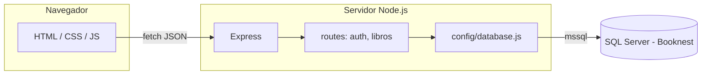
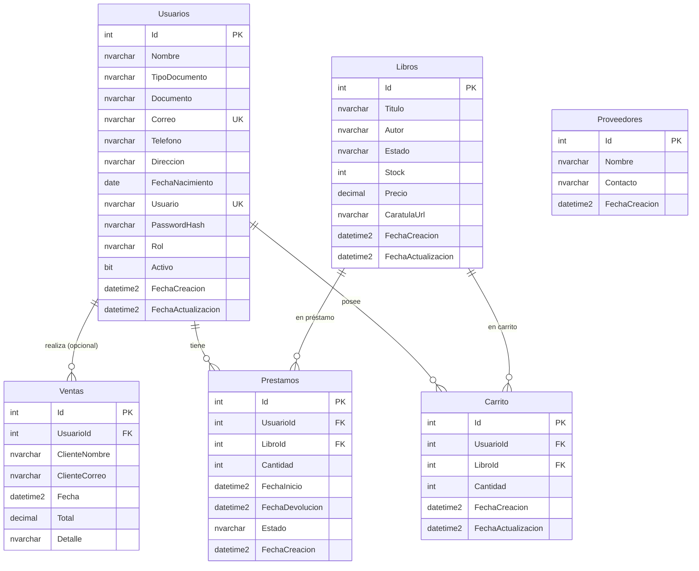

# Libreria-web (Booknest)

Sitio estático (HTML, CSS, JS) más una API en Node.js que habla con **SQL Server**. El navegador no se conecta a la base de datos: solo llama a la API por HTTP.

## Arquitectura



- **Frontend:** páginas en la raíz del repo (`index.html`, `login.html`, etc.). El catálogo público pide los libros a `GET /api/libros`.
- **Backend:** carpeta `server/` — **Express** escucha en el puerto configurado (por defecto **3000**), usa **CORS** y **JSON** en el body.
- **Datos:** el paquete **mssql** abre un pool contra SQL Server; las consultas viven en `server/src/config/database.js` y en cada archivo de rutas.

Estructura relevante:

| Ruta en disco | Rol |
|---------------|-----|
| `server/src/index.js` | Arranque, middleware global, montaje de rutas bajo `/api/...` |
| `server/src/config/database.js` | Conexión y helpers (`getPool`, `query`, `healthCheck`) |
| `server/src/routes/auth.js` | Login, registro, cambio de contraseña |
| `server/src/routes/libros.js` | Catálogo de libros (lectura desde `dbo.Libros`) |
| `server/scripts/create-database.sql` | Esquema inicial (tablas `Usuarios`, `Libros`, etc.) |
| `server/scripts/insert.sql` | Ejemplo de datos de prueba para `Libros` |

## Modelo entidad-relación (base de datos Booknest)

Definido en `server/scripts/create-database.sql` (SQL Server).

| Entidad | Descripción |
|--------|-------------|
| **Usuarios** | Clientes y empleados (correo y usuario únicos, rol, credenciales). |
| **Libros** | Catálogo (título, autor, stock, precio, carátula). |
| **Ventas** | Cabecera de venta; puede ir sin usuario (invitado) con `ClienteNombre` / `ClienteCorreo`; el detalle va en `Detalle` (texto, no tabla hija). |
| **Prestamos** | Préstamo de un libro a un usuario (fechas, estado, cantidad). |
| **Carrito** | Líneas de carrito por usuario; restricción única `(UsuarioId, LibroId)`. |
| **Proveedores** | Catálogo de proveedores sin claves foráneas hacia otras tablas en el script actual. |

**Relaciones:**

- **Usuarios (1) — (0..N) Ventas**: `Ventas.UsuarioId` → `Usuarios.Id` (nullable: venta sin cuenta).
- **Usuarios (1) — (0..N) Prestamos**: `Prestamos.UsuarioId` → `Usuarios.Id` (nullable en DDL).
- **Libros (1) — (0..N) Prestamos**: `Prestamos.LibroId` → `Libros.Id` (nullable en DDL).
- **Usuarios (1) — (1..N) Carrito**: `Carrito.UsuarioId` NOT NULL.
- **Libros (1) — (1..N) Carrito**: `Carrito.LibroId` NOT NULL; única por usuario + libro.



**Notas:** `Proveedores` no tiene relaciones en el diagrama de cardinalidad porque el esquema no define FKs desde/hacia esa tabla. Las líneas de venta no están normalizadas: no existe tabla de detalle; el desglose puede almacenarse en `Ventas.Detalle` (`NVARCHAR(MAX)`).

Variables de entorno del servidor: archivo `server/.env` (servidor, usuario, contraseña, base `Booknest`, puerto, opciones de cifrado). Ver comentarios en `database.js`.

## Carpetas y archivos del servidor: para qué sirven

| Ubicación | Función |
|-----------|---------|
| **`server/package.json`** | Define el proyecto Node (nombre, scripts, dependencias). **`npm install`** lee este archivo y descarga **express**, **mssql**, **cors**, **dotenv**, etc. Los scripts **`npm run start`** y **`npm run dev`** ejecutan `node src/index.js` (el punto de entrada de la API). |
| **`server/.env`** | Variables **solo del servidor** (no deben subirse a git si contienen secretos). Ahí van credenciales y host de SQL Server (`DB_SERVER`, `DB_USER`, `DB_PASSWORD`, `DB_DATABASE`, `PORT`, etc.). **dotenv** las carga al inicio en `index.js` y `database.js` las usa para conectar. Si cambias `.env`, reinicia el proceso de Node. |
| **`server/src/config/`** | Código **compartido de infraestructura**, no rutas HTTP. Aquí está **`database.js`**: crea el pool de **mssql**, expone `getPool()`, `query()`, `healthCheck()`, etc. Las rutas importan este módulo para ejecutar SQL sin repetir la lógica de conexión. Si añadieras Redis u otro cliente, iría en `config/` o en un submódulo similar. |
| **`server/src/routes/`** | Un archivo por **área de la API** (auth, libros, …). Cada uno exporta un **`Router`** de Express con `router.get`, `router.post`, etc. Solo se encarga de HTTP (leer `req.body` / `req.query`, validar, llamar a la BD, responder `res.json`). **No** debe duplicar la configuración del pool: siempre usa `require('../config/database')`. |

El archivo **`server/src/index.js`** une todo: carga Express, CORS, JSON, registra cada router con `app.use('/api/...', require('./routes/...'))` y define rutas sueltas como `/api/health`.

## Verbos HTTP que puedes usar en la API

En Express cada verbo se asocia a un método del router. Los más usados en APIs REST son:

| Verbo | Uso típico | Ejemplo de intención |
|-------|------------|----------------------|
| **GET** | Obtener datos **sin** cambiar el servidor. Puede usar query string (`?id=1`). Debe ser **idempotente** (misma llamada, mismo efecto en el servidor). | Listar libros, obtener un libro por id, health check. |
| **POST** | **Crear** un recurso o disparar una acción que no encaje en GET (p. ej. login). El cuerpo suele ir en JSON (`req.body`). | Registrar usuario, crear libro, iniciar sesión. |
| **PUT** | **Reemplazar** por completo un recurso identificado (p. ej. por id en la URL). | Actualizar todos los campos de un registro. |
| **PATCH** | **Actualizar parcialmente** un recurso (solo algunos campos). | Cambiar solo el stock de un libro. |
| **DELETE** | **Eliminar** un recurso. | Borrar un libro por id. |

Otros (menos habituales en este proyecto): **HEAD** (como GET sin cuerpo), **OPTIONS** (CORS preflight; a menudo lo maneja el middleware). Elige el verbo según semántica y convención REST; lo importante es ser consistente y devolver códigos HTTP claros (`200`, `201`, `400`, `404`, `500`, etc.).

## Paso a paso: crear otra API

1. **Decidir el prefijo y el archivo**  
   Por ejemplo, recursos “reservas” bajo `/api/reservas`. Crea `server/src/routes/reservas.js` (o agrupa en un router existente si es muy pequeño).

2. **Escribir el router**  
   Al inicio del archivo:

   ```js
   const express = require('express');
   const db = require('../config/database');
   const { sql } = db;
   const router = express.Router();
   ```

   Luego define handlers con el verbo adecuado, por ejemplo:

   - `router.get('/', async (req, res) => { ... })` → `GET /api/reservas`
   - `router.post('/', async (req, res) => { ... })` → `POST /api/reservas`
   - `router.get('/:id', async (req, res) => { ... })` → `GET /api/reservas/5`

3. **Acceder a la base de datos**  
   Dentro del handler: `const pool = await db.getPool();`, `const request = pool.request();`, `request.input('nombre', sql.NVarChar, valor);`, `await request.query('SELECT ... WHERE x = @nombre');`. Nunca concatenes strings con datos del usuario en el SQL.

4. **Responder en JSON**  
   Éxito: `res.json({ ... })` o `res.status(201).json({ ... })` para creación. Error: `res.status(400).json({ error: 'mensaje' })`.

5. **Registrar la ruta en `server/src/index.js`**  
   Después de las demás rutas API:

   ```js
   app.use('/api/reservas', require('./routes/reservas'));
   ```

6. **Probar**  
   Con el servidor en marcha (`npm run start` en `server/`), usa el navegador, **curl** o **Postman** contra `http://localhost:3000/api/reservas`. Si el front debe llamarla, usa `fetch` con el mismo origen/puerto que el resto de la app.

7. **(Opcional) Dependencias nuevas**  
   Si necesitas otro paquete npm, en `server/` ejecuta `npm install nombre-paquete`; quedará registrado en **`package.json`** y en **`package-lock.json`**.

## Cómo ejecutar el proyecto

1. Crear la base y tablas ejecutando `server/scripts/create-database.sql` en SQL Server (SSMS o `sqlcmd`).
2. Copiar y completar `server/.env` según tu instancia.
3. En `server/`: `npm install` y `npm run start` (o `npm run dev` con recarga automática).
4. Abrir las páginas HTML (por ejemplo `index.html`) desde el sistema de archivos o sirviéndolas con un servidor estático. Las peticiones `fetch` apuntan a `http://localhost:3000` salvo que cambies la URL en el front.

Comprobaciones útiles:

- `GET http://localhost:3000/api/health` — API y conexión a BD.
- `GET http://localhost:3000/api/ping-db` — versión de SQL Server.
- `GET http://localhost:3000/api/libros` — listado de libros.

## Ingresar un nuevo libro

Hoy el catálogo **solo lee** la tabla `dbo.Libros`; no hay pantalla de administración conectada a un `POST` de alta. Para añadir un libro debes **insertar una fila en SQL Server**.

1. Conéctate a la base **Booknest**.
2. Ejecuta un `INSERT` respetando las columnas de la tabla (definidas en `create-database.sql`):

   - **Titulo** (obligatorio)
   - **Autor** (opcional)
   - **Estado** (por defecto `disponible` en el esquema)
   - **Stock**, **Precio**
   - **CaratulaUrl** — ruta relativa a la web (ej. `img/BookNest.png`) o URL absoluta; si es `NULL`, el front usa una imagen por defecto.

Ejemplo (también puedes usar o adaptar `server/scripts/insert.sql`):

```sql
USE Booknest;
GO

INSERT INTO dbo.Libros (Titulo, Autor, Estado, Stock, Precio, CaratulaUrl)
VALUES (N'Título del libro', N'Nombre del autor', N'disponible', 10, 29900, N'img/BookNest.png');
GO
```

No hace falta indicar **Id** (es `IDENTITY`). Tras insertar, recarga `index.html` con el API en ejecución para ver el libro en el catálogo.

## Cómo están creadas las APIs

Las APIs son **rutas HTTP de Express** registradas en `server/src/index.js`:

- `app.use('/api/auth', require('./routes/auth'));`
- `app.use('/api/libros', require('./routes/libros'));`

Cada módulo en `server/src/routes/` exporta un `Router` de Express:

1. Se define el método y la ruta relativa (por ejemplo `router.post('/login', ...)` queda en `/api/auth/login`).
2. El handler es `async`: obtiene el pool con `await db.getPool()`, arma el `request` de **mssql**, enlaza parámetros con `.input()` para evitar inyección SQL y ejecuta `query()`.
3. La respuesta al cliente es **JSON** (`res.json(...)`) o códigos HTTP de error (`res.status(400).json({ error: '...' })`).

La ruta de **libros** (`libros.js`) solo implementa **GET /**: lee `Libros`, mapea columnas SQL (`Titulo`, `CaratulaUrl`, etc.) a nombres que entiende el front (`titulo`, `caratula`, etc.) y admite búsqueda opcional con el query `?q=`.

Las rutas de **auth** (`auth.js`) cubren registro, login contra la tabla `Usuarios`, registro administrativo y cambio de contraseña, siempre vía SQL parametrizado.

Si en el futuro quieres dar de alta libros desde la web, el patrón sería el mismo: nuevo `router.post(...)` en `libros.js` (o router dedicado), `INSERT` parametrizado y proteger el endpoint (por sesión o rol) según tu modelo de seguridad.
