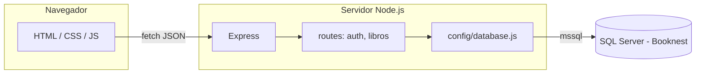

# Libreria-web (Booknest)

Sitio estático (HTML, CSS, JS) más una API en Node.js que habla con **SQL Server**. El navegador no se conecta a la base de datos: solo llama a la API por HTTP.

## Arquitectura



- **Frontend:** páginas en la raíz del repo (`index.html`, `login.html`, etc.). El catálogo público pide los libros a `GET /api/libros`.
- **Backend:** carpeta `server/` — **Express** escucha en el puerto configurado (por defecto **3000**), usa **CORS** y **JSON** en el body.
- **Datos:** el paquete **mssql** abre un pool contra SQL Server; las consultas viven en `server/src/config/database.js` y en cada archivo de rutas.

Estructura relevante:

| Ruta en disco | Rol |
|---------------|-----|
| `server/src/index.js` | Arranque, middleware global, montaje de rutas bajo `/api/...` |
| `server/src/config/database.js` | Conexión y helpers (`getPool`, `query`, `healthCheck`) |
| `server/src/routes/auth.js` | Login, registro, cambio de contraseña |
| `server/src/routes/libros.js` | Catálogo de libros (lectura desde `dbo.Libros`) |
| `server/scripts/create-database.sql` | Esquema inicial (tablas `Usuarios`, `Libros`, etc.) |
| `server/scripts/insert.sql` | Ejemplo de datos de prueba para `Libros` |

Variables de entorno del servidor: archivo `server/.env` (servidor, usuario, contraseña, base `Booknest`, puerto, opciones de cifrado). Ver comentarios en `database.js`.

## Cómo ejecutar el proyecto

1. Crear la base y tablas ejecutando `server/scripts/create-database.sql` en SQL Server (SSMS o `sqlcmd`).
2. Copiar y completar `server/.env` según tu instancia.
3. En `server/`: `npm install` y `npm run start` (o `npm run dev` con recarga automática).
4. Abrir las páginas HTML (por ejemplo `index.html`) desde el sistema de archivos o sirviéndolas con un servidor estático. Las peticiones `fetch` apuntan a `http://localhost:3000` salvo que cambies la URL en el front.

Comprobaciones útiles:

- `GET http://localhost:3000/api/health` — API y conexión a BD.
- `GET http://localhost:3000/api/ping-db` — versión de SQL Server.
- `GET http://localhost:3000/api/libros` — listado de libros.

## Ingresar un nuevo libro

Hoy el catálogo **solo lee** la tabla `dbo.Libros`; no hay pantalla de administración conectada a un `POST` de alta. Para añadir un libro debes **insertar una fila en SQL Server**.

1. Conéctate a la base **Booknest**.
2. Ejecuta un `INSERT` respetando las columnas de la tabla (definidas en `create-database.sql`):

   - **Titulo** (obligatorio)
   - **Autor** (opcional)
   - **Estado** (por defecto `disponible` en el esquema)
   - **Stock**, **Precio**
   - **CaratulaUrl** — ruta relativa a la web (ej. `img/BookNest.png`) o URL absoluta; si es `NULL`, el front usa una imagen por defecto.

Ejemplo (también puedes usar o adaptar `server/scripts/insert.sql`):

```sql
USE Booknest;
GO

INSERT INTO dbo.Libros (Titulo, Autor, Estado, Stock, Precio, CaratulaUrl)
VALUES (N'Título del libro', N'Nombre del autor', N'disponible', 10, 29900, N'img/BookNest.png');
GO
```

No hace falta indicar **Id** (es `IDENTITY`). Tras insertar, recarga `index.html` con el API en ejecución para ver el libro en el catálogo.

## Cómo están creadas las APIs

Las APIs son **rutas HTTP de Express** registradas en `server/src/index.js`:

- `app.use('/api/auth', require('./routes/auth'));`
- `app.use('/api/libros', require('./routes/libros'));`

Cada módulo en `server/src/routes/` exporta un `Router` de Express:

1. Se define el método y la ruta relativa (por ejemplo `router.post('/login', ...)` queda en `/api/auth/login`).
2. El handler es `async`: obtiene el pool con `await db.getPool()`, arma el `request` de **mssql**, enlaza parámetros con `.input()` para evitar inyección SQL y ejecuta `query()`.
3. La respuesta al cliente es **JSON** (`res.json(...)`) o códigos HTTP de error (`res.status(400).json({ error: '...' })`).

La ruta de **libros** (`libros.js`) solo implementa **GET /**: lee `Libros`, mapea columnas SQL (`Titulo`, `CaratulaUrl`, etc.) a nombres que entiende el front (`titulo`, `caratula`, etc.) y admite búsqueda opcional con el query `?q=`.

Las rutas de **auth** (`auth.js`) cubren registro, login contra la tabla `Usuarios`, registro administrativo y cambio de contraseña, siempre vía SQL parametrizado.

Si en el futuro quieres dar de alta libros desde la web, el patrón sería el mismo: nuevo `router.post(...)` en `libros.js` (o router dedicado), `INSERT` parametrizado y proteger el endpoint (por sesión o rol) según tu modelo de seguridad.
